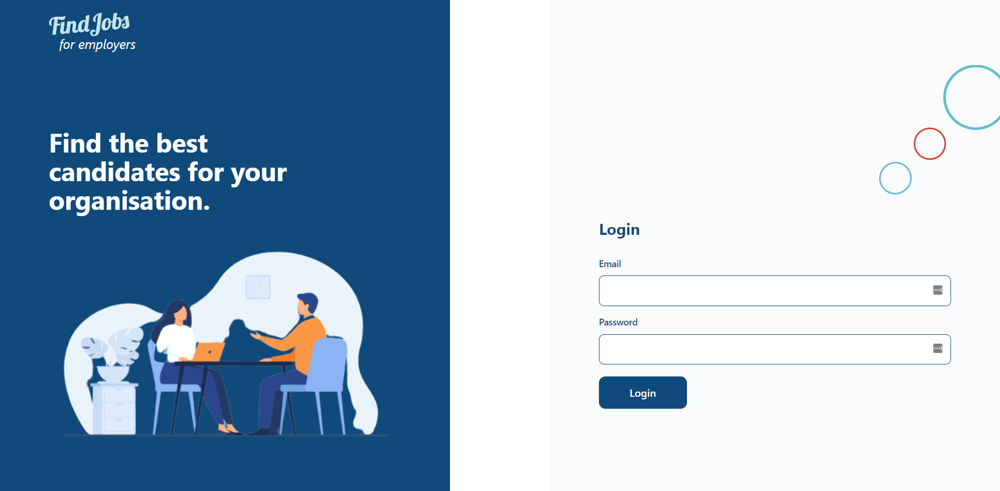

# Job Listing Web App

This project was bootstrapped with [Create React App](https://github.com/facebook/create-react-app).

This is a solution to a potential (name withheld) employer challenge.

## Table of contents

- [Overview](#overview)
  - [The challenge](#the-challenge)
  - [Screenshot](#screenshot)
  - [Links](#links)
- [My process](#my-process)
  - [Built with](#built-with)
  - [Continued development](#continued-development)
- [Author](#author)

## Overview

### The challenge

Excerpts from the challenge:

"In order to be successful, the acceptance criteria below must be met.

1. A Business/User should have the ability to create, update and delete a job.
2. A Guest Should be able to browse through a List of Jobs
3. A Guest should be able to view and apply for a Job
4. A Guest can search for a Job
5. A Business/User can see a list of jobs they created"

### Screenshot

### Links

- Live Site URL: [Netlify](https://mikeattah.github.io/insure-landing-page/)

## My process

### Built with

- React.js
- TypeScript
- Tailwind CSS
- Apollo/GraphQL

### Continued development

I will continue to learn how to get and post data using graphql.

### Useful resources

## Author

- Website - [Mike Attah](https://www.mikeattah.com)
- Twitter - [@mikeattahx](https://www.twitter.com/mikeattahx)
